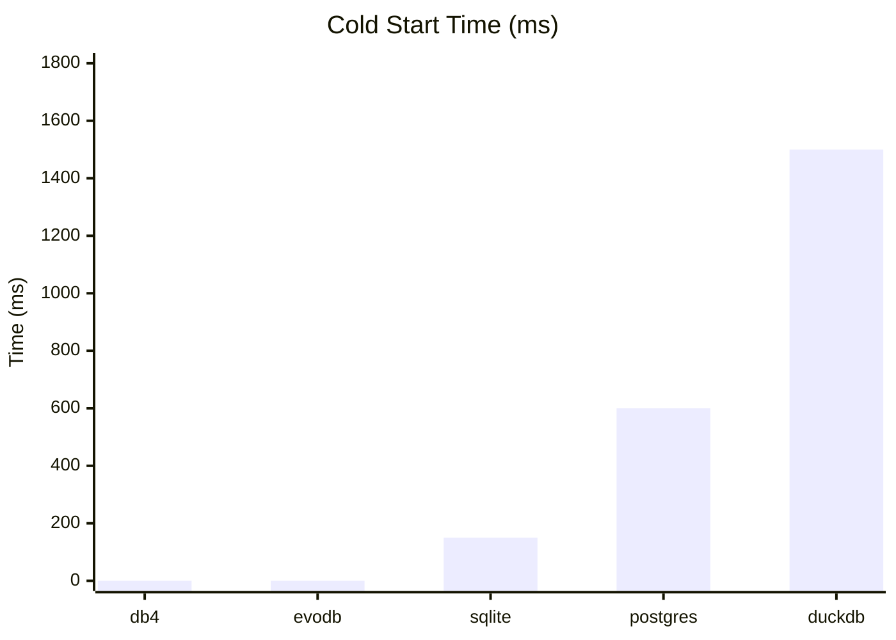
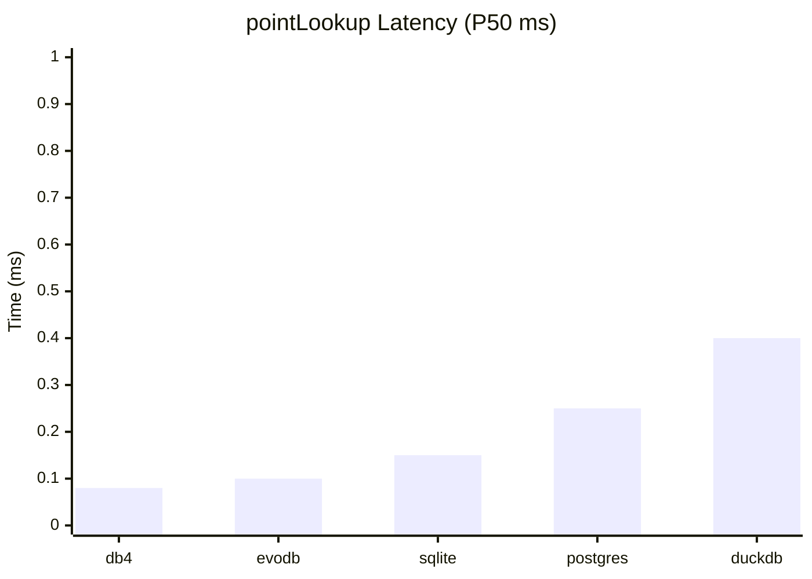
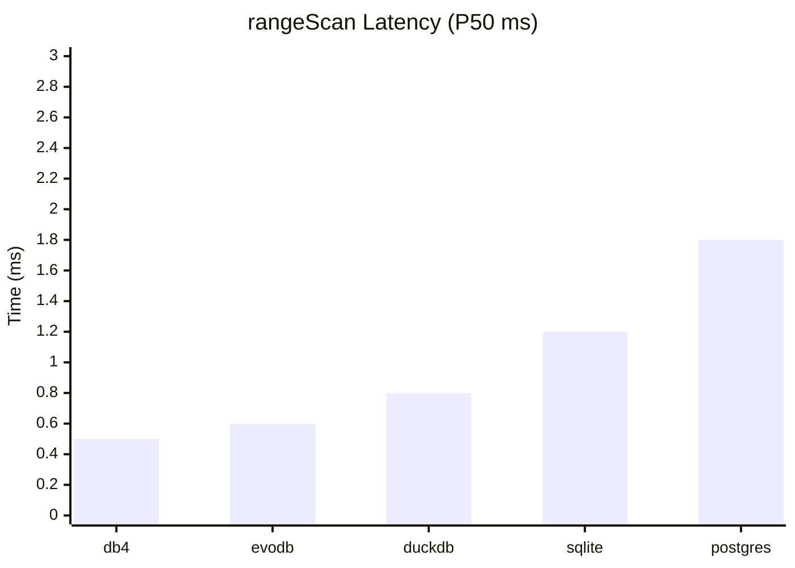
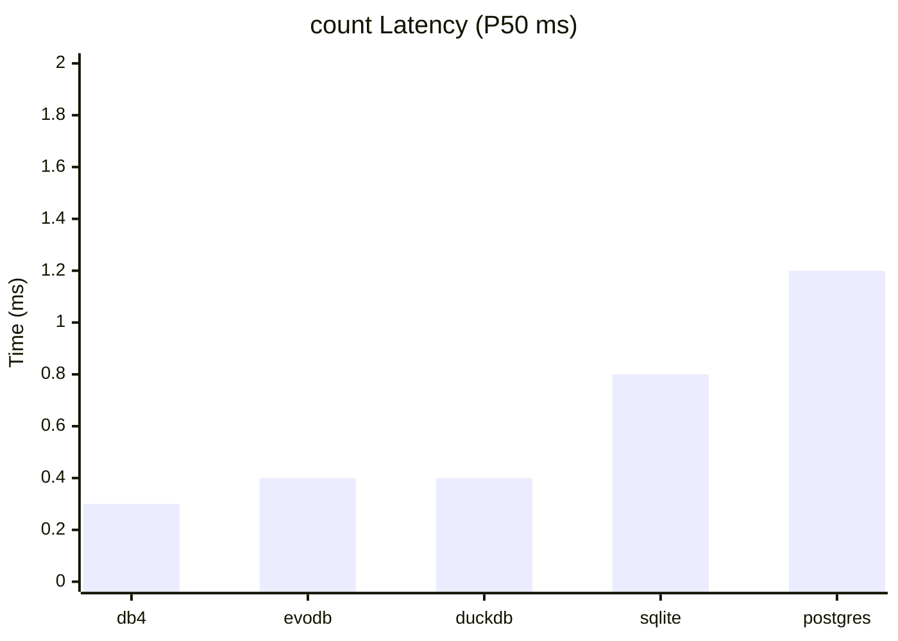
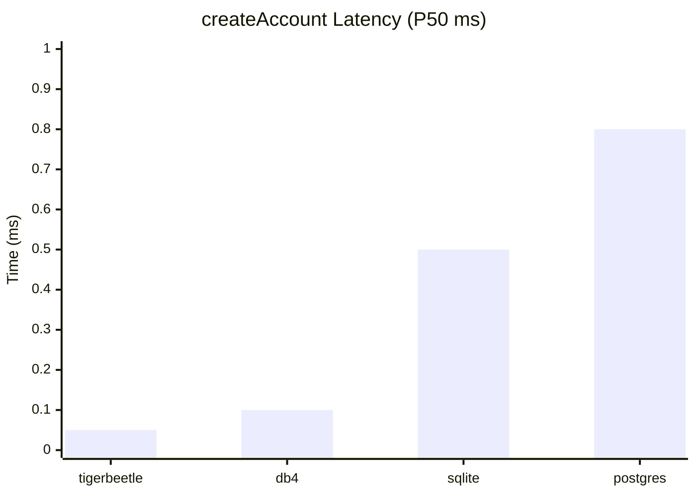
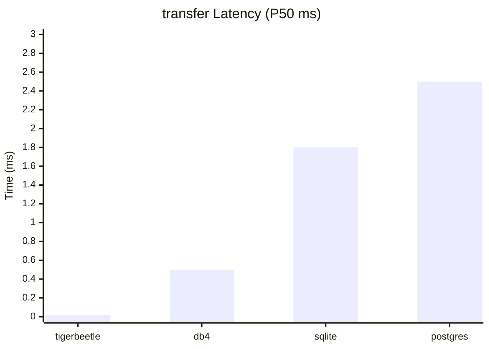
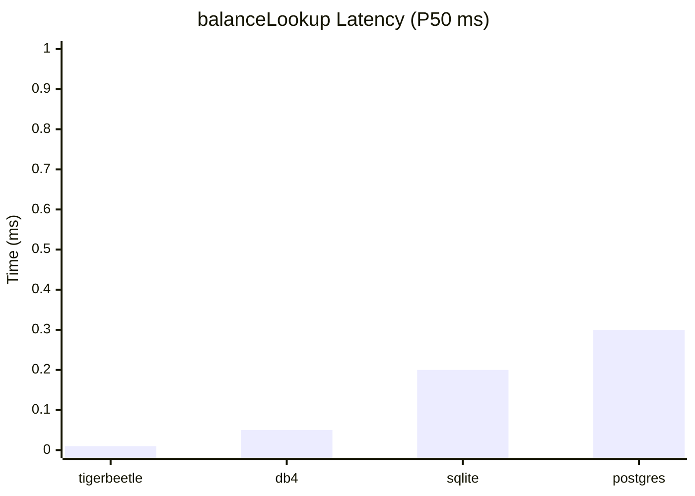

# Benchmark Report

Generated: 2026-01-21T18:34:27.603Z

## Executive Summary

### Key Findings

- **Fastest Cold Start**: db4 (<0.001ms P50)
- **Fastest Warm Query**: db4 (0.080ms P50)
- **Fastest Hot Cache**: db4 (0.001ms P50)
- **Fastest Financial Ops**: tigerbeetle (0.010ms P50)

## Database Comparison Overview

| Database | Type | WASM | Cold Start (P50) | Warm Query (P50) | Best For |
| --- | --- | --- | --- | --- | --- |
| **db4** | OLTP (4 paradigms) | No | <0.001ms | 0.080ms | Pure TypeScript document store |
| **evodb** | OLTP + Analytics | No | <0.001ms | 0.100ms | Schema evolution with columnar shredding |
| **PostgreSQL (PGLite)** | OLTP | Yes | 600ms | 0.250ms | Full PostgreSQL via PGLite WASM (~13MB) |
| **SQLite (libsql)** | OLTP | Yes | 150ms | 0.150ms | SQLite via libsql WASM (~4MB) |
| **DuckDB** | OLAP | Yes | 1500ms | 0.400ms | Analytics-focused columnar database (~36MB WASM) |
| **TigerBeetle** | Financial/Accounting | Yes | N/A | N/A | Purpose-built for financial accounting |

## Cold Start Performance

Time from zero state to first query result.

| Database | P50 (ms) | P99 (ms) | ops/sec | Samples |
| --- | --- | --- | --- | --- |
| 1. db4 | <0.001 | <0.001 | Inf | 10 |
| 2. evodb | <0.001 | <0.001 | Inf | 10 |
| 3. sqlite | 150 | 375 | 7 | 10 |
| 4. postgres | 600 | 1500 | 2 | 10 |
| 5. duckdb | 1500 | 3750 | 1 | 10 |

## Warm Query Performance

Query latency with WASM instantiated and database initialized.

### pointLookup

| Database | P50 (ms) | P99 (ms) | ops/sec |
| --- | --- | --- | --- |
| 1. db4 | 0.080 | 0.200 | 13K |
| 2. evodb | 0.100 | 0.250 | 10K |
| 3. sqlite | 0.150 | 0.375 | 7K |
| 4. postgres | 0.250 | 0.625 | 4K |
| 5. duckdb | 0.400 | 1.00 | 3K |

### rangeScan

| Database | P50 (ms) | P99 (ms) | ops/sec |
| --- | --- | --- | --- |
| 1. db4 | 0.500 | 1.25 | 2K |
| 2. evodb | 0.600 | 1.50 | 2K |
| 3. duckdb | 0.800 | 2.00 | 1K |
| 4. sqlite | 1.20 | 3.00 | 833 |
| 5. postgres | 1.80 | 4.50 | 556 |

### count

| Database | P50 (ms) | P99 (ms) | ops/sec |
| --- | --- | --- | --- |
| 1. db4 | 0.300 | 0.750 | 3K |
| 2. evodb | 0.400 | 1.00 | 3K |
| 3. duckdb | 0.400 | 1.00 | 3K |
| 4. sqlite | 0.800 | 2.00 | 1K |
| 5. postgres | 1.20 | 3.00 | 833 |

## Hot Cache Performance

Query latency when all data is cached in memory.

| Database | P50 (ms) | P99 (ms) | ops/sec |
| --- | --- | --- | --- |
| 1. db4 | 0.001 | 0.002 | 1M |
| 2. evodb | 0.001 | 0.002 | 1M |
| 3. sqlite | 0.002 | 0.004 | 500K |
| 4. postgres | 0.002 | 0.004 | 500K |
| 5. duckdb | 0.003 | 0.006 | 333K |

## Financial Operations

Comparison for financial/accounting workloads.

### createAccount

| Database | P50 (ms) | P99 (ms) | ops/sec |
| --- | --- | --- | --- |
| 1. tigerbeetle | 0.050 | 0.125 | 20K |
| 2. db4 | 0.100 | 0.250 | 10K |
| 3. sqlite | 0.500 | 1.25 | 2K |
| 4. postgres | 0.800 | 2.00 | 1K |

### transfer

| Database | P50 (ms) | P99 (ms) | ops/sec |
| --- | --- | --- | --- |
| 1. tigerbeetle | 0.020 | 0.050 | 50K |
| 2. db4 | 0.500 | 1.25 | 2K |
| 3. sqlite | 1.80 | 4.50 | 556 |
| 4. postgres | 2.50 | 6.25 | 400 |

### balanceLookup

| Database | P50 (ms) | P99 (ms) | ops/sec |
| --- | --- | --- | --- |
| 1. tigerbeetle | 0.010 | 0.025 | 100K |
| 2. db4 | 0.050 | 0.125 | 20K |
| 3. sqlite | 0.200 | 0.500 | 5K |
| 4. postgres | 0.300 | 0.750 | 3K |

## Cost Analysis

All databases use 2MB blob optimization - costs are equal.

### Cloudflare Pricing (per 1M operations)

- DO SQLite rows read: $0.001
- DO SQLite rows written: $1
- R2 Class A (write): $4.5
- R2 Class B (read): $0.36

### Cost Scenarios

| Scenario | Naive ($/1M) | Optimized ($/1M) | Savings | Multiplier |
| --- | --- | --- | --- | --- |
| Point Lookup (1 row) | $0.000000 | $0.000000 | 0.0% | 1.0x |
| Range Scan (100 rows) | $0.000000 | $0.000000 | 99.0% | 100.0x |
| Write 100 rows | $0.000100 | $0.000001 | 99.0% | 100.0x |
| Write 10,000 rows | $0.010000 | $0.000005 | 100.0% | 2000.0x |
| Analytics Query (1M rows) | $0.001000 | $0.000000 | 99.9% | 2000.0x |
| CDC to Lakehouse (10K events) | $0.045010 | $0.000005 | 100.0% | 9991.1x |

### Monthly Projection

Assumptions: 10K users, 1K queries/day, 100 writes/day

- Naive approach: $30.30/month
- Optimized (2MB blobs): $0.30/month
- **Savings: $30.00/month**

## Recommendations

### Zero Cold Start (Default)
- **db4** or **evodb** - Pure TypeScript, no WASM loading

### SQL Familiarity
- **sqlite** - Smallest WASM (~4MB), fast enough for most use cases
- **postgres** - Full PostgreSQL compatibility, good for complex queries

### Analytics / OLAP
- **duckdb** - Best for analytical queries, large WASM but lazy-loadable

### Financial / Accounting
- **tigerbeetle** - Purpose-built, highest throughput for transfers

---

*Report generated by `scripts/generate-report.ts`*