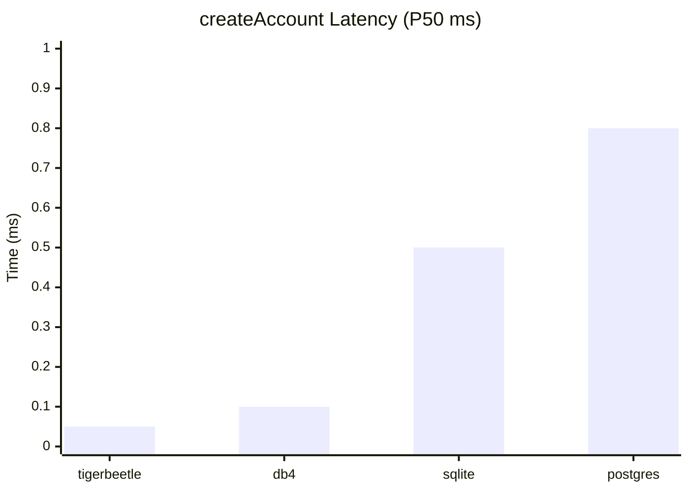
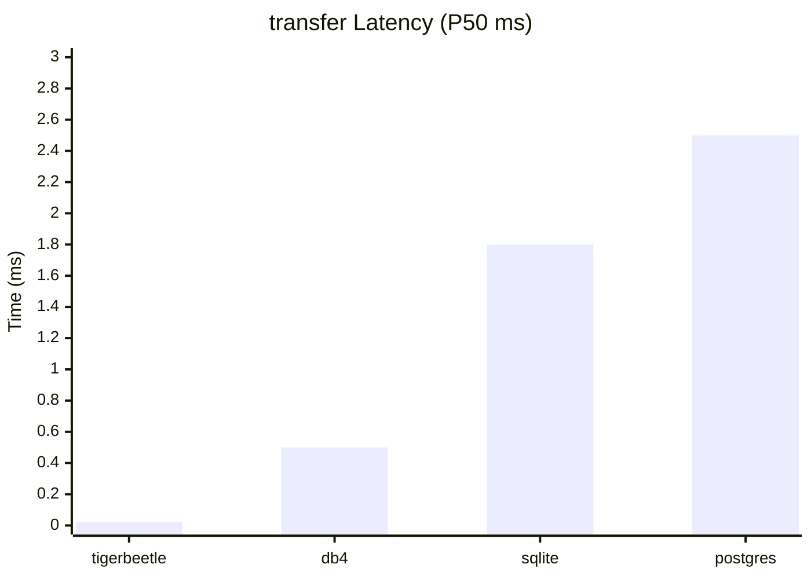
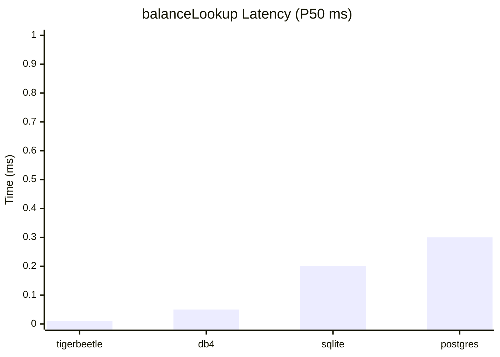

# Financial/Ledger Dataset Comparison

Generated: 2026-01-21T18:34:27.606Z

## Overview

- **Category**: FINANCIAL
- **Description**: Double-entry bookkeeping, transfers, balances

## createAccount

| Database | P50 (ms) | P99 (ms) | ops/sec | Rank |
| --- | --- | --- | --- | --- |
| tigerbeetle | 0.050 | 0.125 | 20K | 1 |
| db4 | 0.100 | 0.250 | 10K | 2 |
| sqlite | 0.500 | 1.25 | 2K | 3 |
| postgres | 0.800 | 2.00 | 1K | 4 |

## transfer

| Database | P50 (ms) | P99 (ms) | ops/sec | Rank |
| --- | --- | --- | --- | --- |
| tigerbeetle | 0.020 | 0.050 | 50K | 1 |
| db4 | 0.500 | 1.25 | 2K | 2 |
| sqlite | 1.80 | 4.50 | 556 | 3 |
| postgres | 2.50 | 6.25 | 400 | 4 |

## balanceLookup

| Database | P50 (ms) | P99 (ms) | ops/sec | Rank |
| --- | --- | --- | --- | --- |
| tigerbeetle | 0.010 | 0.025 | 100K | 1 |
| db4 | 0.050 | 0.125 | 20K | 2 |
| sqlite | 0.200 | 0.500 | 5K | 3 |
| postgres | 0.300 | 0.750 | 3K | 4 |

## Overall Performance Ranking

| Rank | Database | Avg. Rank | Operations |
| --- | --- | --- | --- |
| 1 | tigerbeetle | 1.00 | 3 |
| 2 | db4 | 2.00 | 3 |
| 3 | sqlite | 3.00 | 3 |
| 4 | postgres | 4.00 | 3 |

## Recommendations

For Financial/Ledger workloads, **tigerbeetle** provides the best overall performance.

**db4** is a good alternative if tigerbeetle doesn't meet other requirements.

---

*Report generated by `scripts/generate-report.ts`*